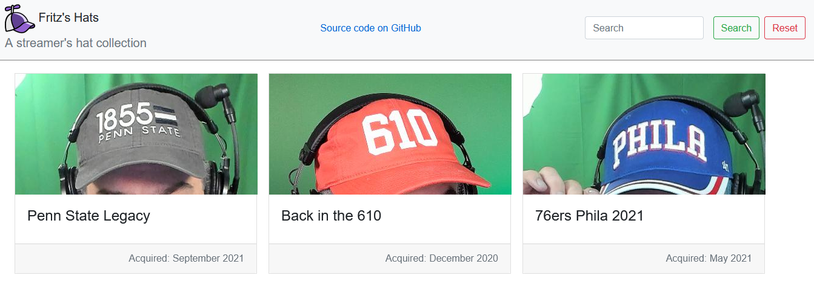

# Fritz's Hat Collection

This repository contains an example [Blazor WebAssembly](https://docs.microsoft.com/aspnet/core/blazor/?view=aspnetcore-3.1#blazor-webassembly) client application, a C# [Azure Functions](https://docs.microsoft.com/azure/azure-functions/functions-overview) and a C# class library with shared code.  Fritz wrote these to demonstrate a simple Blazor site showing off his collection of hats.

## Re-using this project

Fork this repository from the and then clone it locally to your machine.  This project is based on .NET Core 3.1 for the Azure functions and .NET 6 for the Blazor web-assembly application.
Create a repository from the [GitHub template](https://github.com/staticwebdev/blazor-starter/generate) and then clone it locally to your machine.

Once you clone the project, open the solution in [Visual Studio](https://visualstudio.microsoft.com/vs/community/) and press **F5** to launch both the client application and the Functions API app.

_Note: If you're using the Azure Functions CLI tools, refer to [the documentation](https://docs.microsoft.com/azure/azure-functions/functions-run-local?tabs=windows%2Ccsharp%2Cbash) on how to enable CORS._

## Template Structure

* **Client**: The Blazor WebAssembly application that displays the hat collection
* **API**: A C# Azure Functions API, which the Blazor application will call to fetch the hats to display
* **Shared**: A C# class library with a shared data model between the Blazor and Functions application

## Deploy to Azure Static Web Apps

This application can be deployed to [Azure Static Web Apps](https://docs.microsoft.com/azure/static-web-apps), to learn how, check out [our quickstart guide](https://aka.ms/blazor-swa/quickstart).

You can check out the various times this application has been deployed by reviewing the [Actions](actions) tab at the top of the repository.  The GitHub action definition that definies this deployment process is available in the [.github/workflows](/csharpfritz/Fritz.HatCollection/tree/main/.github/workflows) folder
